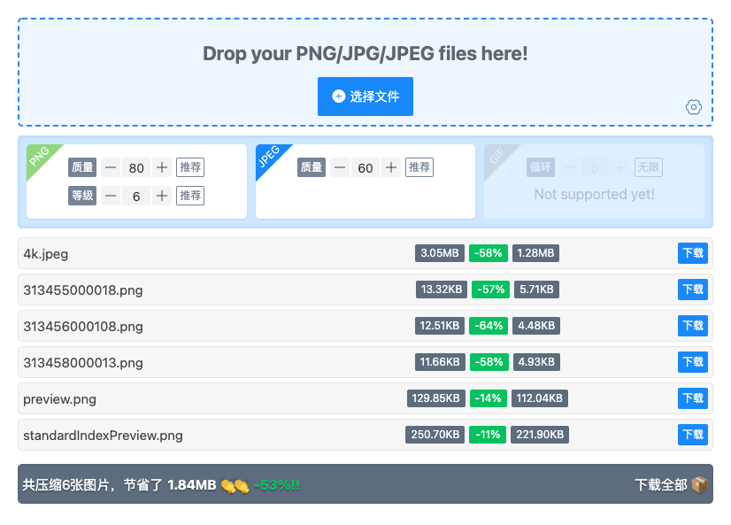

基于 node 服务的图片压缩和下载工具，目前支持图片格式 jpg、png。

#### Powered by

-   **SERVER:** Node(>=12.13) & multer & sharp
-   **FRONT:** Vue & Vant

#### How to use

1. 打包单页面并启动本地 node 服务

```node
// 默认端口为8080
npm start

// 如果需要指定端口
npm start -- PORT=XXXX
```

2. 在浏览器中访问

```
// 默认端口
localhost:8080

// 或指定端口
localhost:XXXX
```

在浏览器页面中设置压缩参数，参数设置完成后选取(支持拖拽)本地图片，图片读取成功后 node 会自动进行压缩打包处理。压缩打包结束后，浏览器中会显示详细的压缩数据，同时支持单张图片下载或所有压缩图的 zip 包下载。如下图所示：



> 压缩参数说明：`质量`代表了压缩后图片的色彩丰富程度，设定的值越小，压缩后的图片越小；`等级`代表了压缩程度，设定的值越大，压缩后的图片越小。

#### To do next

-   [ ] 增加 Gif 压缩
-   [ ] 删除 vant 引用
-   [ ] 优化 npm script
-   [ ] 增加压缩前的可配置选项(如压缩质量)
-   [ ] travis 自动集成部署
-   [ ] 测试并发请求
